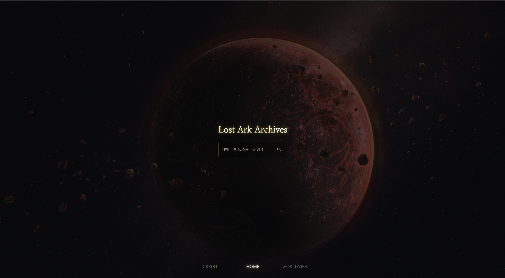
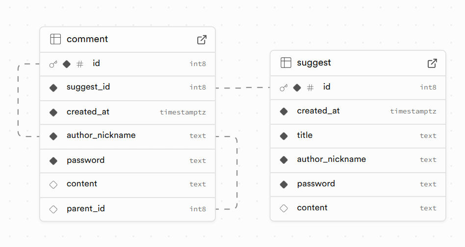
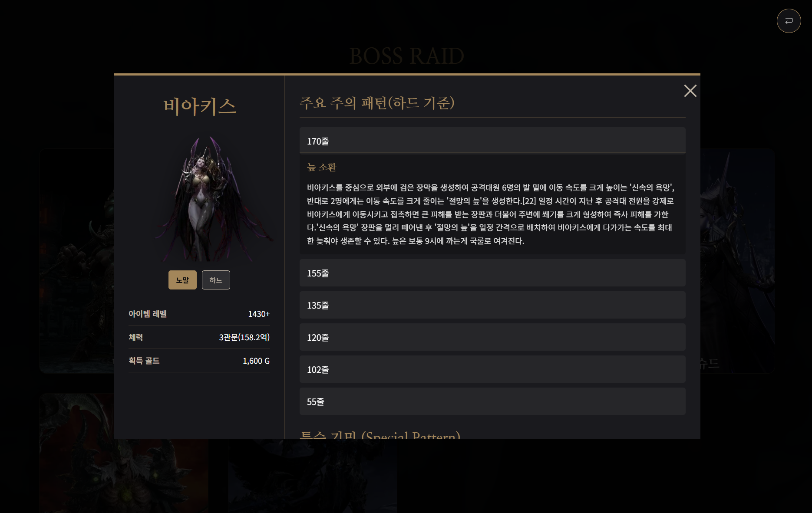
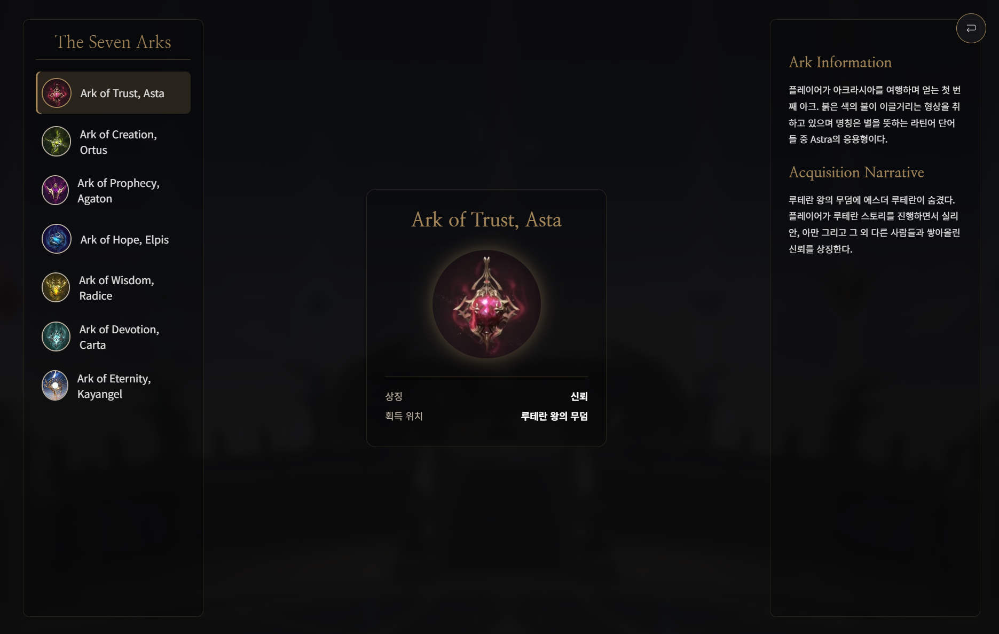

# **LSA (Lostark Story Archives)**
<!--프로젝트 메인 이미지-->

### **<주의> 해당 페이지의 모든 Source는 "(주)스마일게이트"에 저작권이 있습니다.**
  
<!--목차-->
## 목차
- [**Project**](#project)
    - [Features](#features)
    - [Techniques](#techniques)
    - [Distribution](#distribution)
- [**DB Table**](#db-table)
- [**Page**](#page)
    - [Index Page](#index-element)
    - [Home Page](#home-page)
    - [Worldview Page](#worldview-page)
    - [Continents Page](#continents-page)
    - [Chracters Page](#chracters-page)
    - [BossRaid Page](#bossRaid-page)
    - [Ark Page](#ark-page)
    - [Class Page](#class=page)
    - [Suggest Page](#suggest=page)
    - [Credit Page](#credit=page)
- [**Contact**](#contact)

<!--프로젝트 설명-->
## **Project**
- 해당 프로젝트는 **스마일게이트사의 MMORPG 로스트아크**의 정보를 전달하기 위해 제작되었습니다.
- AI의 사용법 및 적응을 위해 80% 정도 AI를 이용하여 프로젝트를 진행하였으며 주로 Gemini를 이용하였습니다.
- 해당 프로젝트는 다양한 라이브러리와 Interactive Web을 목표로 제작되었습니다.
- SPA로 구현되어 있으며, 태블릿 및 모바일 환경까지 생각하여 반응형 사이트로 제작하였습니다.

### **Features**
- ServerLess로 개발되어 있으며 Database는 PostgreSQL을 사용하는 Supabase를 이용하였습니다.
- JS에도 데이터를 저장하여 데이터를 가져오는 방법을 학습했습니다.
- 사용자 UX를 해치지 않기 위해 로스트아크 게임을 진행하면서 접하기 쉬운 화면의 구조를 사용하였습니다.
- Three.js, Vanta.js, GSAP, crypto-js, react-youtube, supabase-js, swiper.js 등 다양한 기능을 가진 라이브러리를 사용하여 기능을 구현하였습니다.

### **Techniques**
- [**HTML5, CSS3, JavaScript**]
*   
- [**React.js** ]
* 
- [**Supabase**]
* 
- [**Visual Studio Code**]
* 
- AI
* 
### **Distribution**
- URL : <a href="https://lsa-blue.vercel.app/" target="_blank">LSA</a>

### **DB Table**
 
* Javascript에서 데이터를 가져오는 경험을 위해 대부분 Javascript에 저장
* Suggest 및 Commnet를 작성하는 경우 회원가입 및 계정이 존재하지 않기 때문에 닉네임 + 비밀번호로 개인화
* 비밀번호는 MD-5 암호화 방법을 사용하여 수정, 삭제 시 인증

<!--각 페이지 설명-->
## **Page**
- Page 전환 : activePage 변수를 이용하여 swiper를 이용한 메뉴에서 클릭하는 경우 데이터를 할당한 후 값에 맞춰 페이지 전환

### **Index Page**

- **Index Page**입니다. 해당 페이지는 페이지 접근 직후 출력되는 랜딩 페이지 입니다.
- 해당 프로젝트의 목적, 아키텍쳐, 클래스다이어그램, 주요 특징, 기술 스택, 공식 사이트와의 차이점을 출력합니다.
- Vanta.js를 이용하여 배경화면 구성하였습니다.
- 스크롤 이벤트를 통해 애니메이션 동작을 구현하였습니다.

### **Home Page**

- **Main Page**입니다. 해당 페이지는 로딩페이지에서 로드 직후 출력되는 페이지 입니다.
- 각 메뉴 전환에 맞춰 배경화면이 변경됩니다.

- 데이터들의 id 혹은 title, name을 기준으로 검색이 가능합니다.
- 검색한 후 매칭되는 결과가 존재한다면 출력되고 없다면 관련된 정보가 없습니다. 라고 출력됩니다.
- 결과가 존재한다면 해당 페이지의 데이터로 이동할 수 있습니다.

### **Worldview Page**

- **Worldview Page**입니다. 로스트아크 게임을 시작하기 전 세계관의 정보를 출력하는 페이지입니다.
- 마우스의 위치에 따른 애니메이션과 각 버튼에 hover되는 경우 배경 이미지가 변경됩니다.
- 서론과 결론은 gsap의 text animation을 이용하여 타이핑하는 효과를 구현했습니다.

> 사용자의 UX를 고려하여 제작되었습니다.  
***해당 페이지는 공식 사이트의 세계관 페이지 구조를 참고하였습니다.***

### **Continents page**

- **Continents page**입니다. User가 게임을 진행하며 나아가는 대륙들의 스토리를 출력하는 페이지입니다.
- GSAP의 SVG Path를 이용한 대륙 별 순서를 잇고 게임에서 map에 표시되는 아이콘을 Figma를 이용해 제작하였습니다.
- 각 대륙 별 스토리는 absolute를 이용하여 map위에 위치하였습니다.

> 사용자의 UX를 고려하여 제작되었습니다.  
***해당 페이지는 InGame의 Map 구조를 참고하였습니다.***

### **Chracters Page**

- **Chracters Page**입니다. 스토리를 진행하며 만나는 주요 등장 NPC를 출력합니다.
- 각 캐릭터 카드에는 3D 카드처럼 보이도록 Interaction을 구현하였습니다.
- 각 캐릭터 카드를 클릭하면 모달에 해당 캐릭터의 정보가 출력되며 이름, 소속, 종족, 기본정보, 능력, 서사, 에스더 스킬 & 연합군 스킬의 정보가 출력됩니다.
- 모달의 이미지를 클릭하는 경우 전체 화면으로 이미지가 출력되며 Download 이미지를 통해 저장할 수 있습니다. 

> 사용자의 UX를 고려하여 제작되었습니다.  
***해당 페이지는 InGame의 캐릭터 정보 화면 구조를 참고하였습니다.***

### **BossRaid Page**

-  **BossRaid Page**입니다. 해당 페이지는 다양한 Boss의 정보를 확인할 수 있습니다..
-  각 카드의 hover 효과는 characterPage와 동일합니다. 각 보스 별 아이템 레벨, 체력, 골드, 체력 별 기믹을 출력합니다. 

> 사용자의 UX를 고려하여 제작되었습니다.  
***해당 페이지는 InGame의 사전 구조를 참고하였습니다.***

### **Ark Page**

- **Ark Page**입니다. 로스트아크의 주요 키워드인 아크의 정보를 출력합니다.
- 중앙 이미지에 마우스를 hover하는 경우 애니메이션이 출력됩니다.

> 사용자의 UX를 고려하여 제작되었습니다.  
***해당 페이지는 InGame의 강화 화면을 참고하였습니다.***

### **Class Page**

- **Class Page**입니다. 각 직업 별 정보를 출력합니다.
- sprite 이미지를 이용하여 CSS의 Translate를 이용해 위치를 잡아주었습니다.

> 사용자의 UX를 고려하여 제작되었습니다.  
***해당 페이지는 InGame의 캐릭터 생성(직업 선택) 화면을 참고하였습니다.***

### **Suggest Page**

- **Suggest Page**입니다. 해당 페이지에 대하여 추가 및 정보를 교환하기 위한 페이지입니다.
- 배경화면은 react-youtebe 라이브러리를 이용하여 youtebe 영상을 출력합니다.
- 영상을 시청하고 싶은 경우 게시판을 최소화 시켜 확인할 수 있습니다. 반대로 최대화도 가능합니다.
- 로그인 기능이 없기 때문에 닉네임과 비밀번호를 통하여 작성한 글의 CRUD를 수행할 수 있습니다.
- 비밀번호는 crypto-js 라이브러리를 이용하여 MD5로 암호화 하였습니다.

### **Credit Page**

- **Credit Page**입니다. 해당 프로젝트의 목적, 후기, 이미지, 사용 기술, git 주소가 출력됩니다.
- Three.js를 이용하여 배경화면에 바다가 파도치는 모습을 표현하였습니다.
- 모달 대신 div를 생성하고 absolute로 설정하여 마우스를 이용해 클릭해서 움직이는 것이 가능하도록 만들었습니다.
> 이유는 메모리 소모량을 줄이고 다수의 모달을 띄우기 위해서입니다.
- 이미지는 저작권 표시 후 hover 시 미리보기, 다운로드 버튼 클릭 시 다운로드 받을 수 있도록 기능을 구현하였습니다.

> 사용자의 UX를 고려하여 제작되었습니다.  
***해당 페이지는 InGame의 서버 선택 화면을 참고하였습니다.***

<!--접근-->
## **Contact**
- 📧  **wodnd565@gmail.com**
